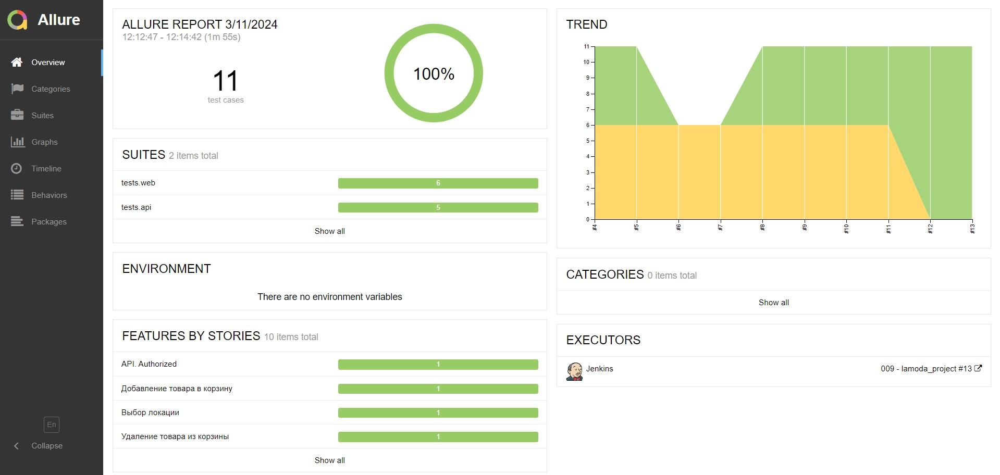
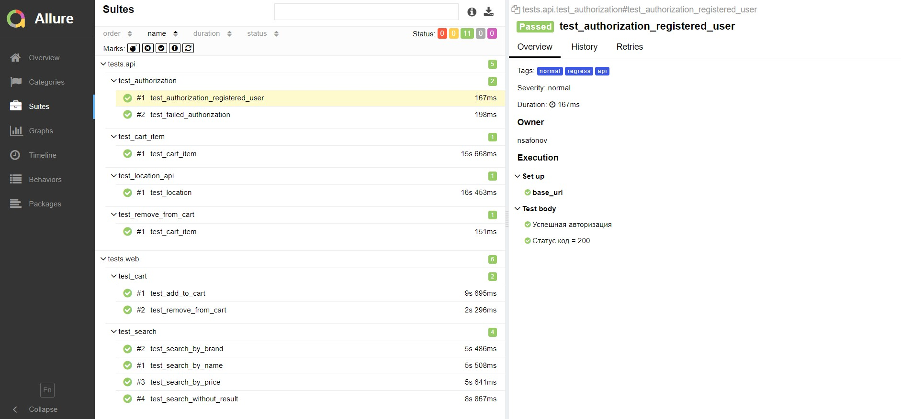
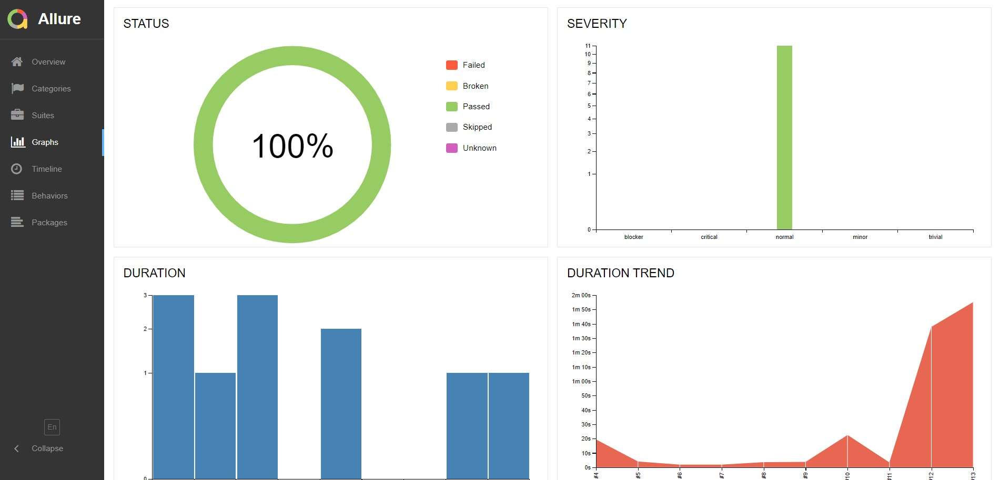
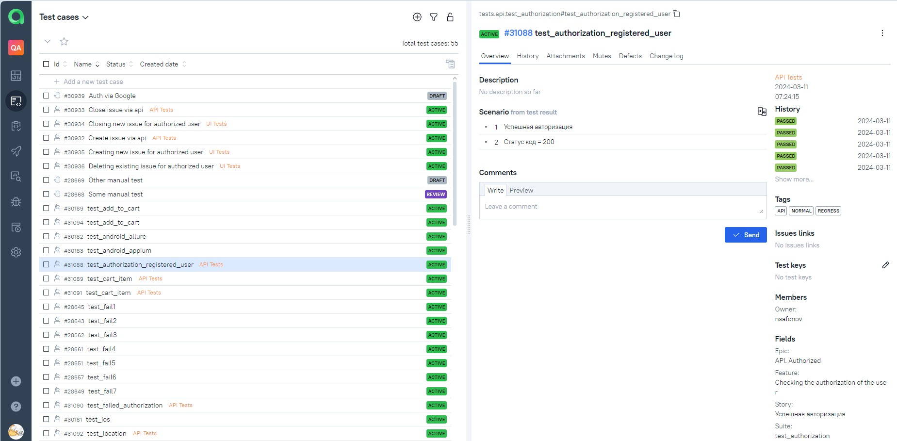
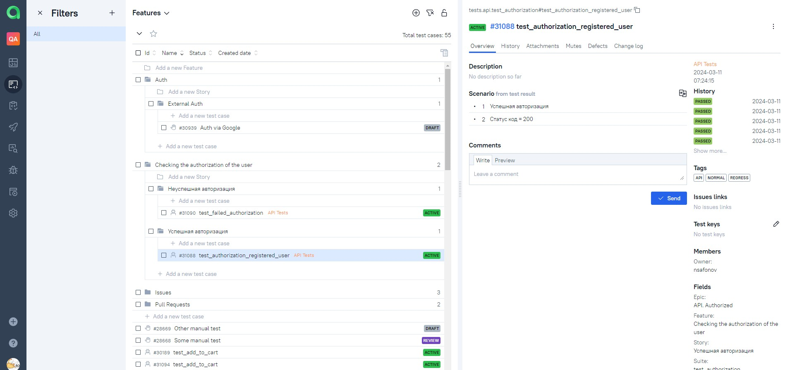

<h1 align="center">Проект по тестированию интернет-магазина

---

<p align="center">
<a href="https://www.lamoda.ru/">  </a> </h1>

---

### Особенности проекта

* UI и API тесты
* Сборка проекта в Jenkins
* Отчеты Allure Report
* Интеграция с Allure TestOps
* Запуск автотестов в Selenoid

---

### Список реализованных автотестов (web)

- [x] Добавление товара в корзину  
- [x] Удаление товара из корзины
- [x] Поиск товара по названию модели 
- [x] Проверка товара на соответствие бренду
- [x] Проверка товара на соответствие стоимости
- [x] Поиск несуществующего товара

### Список реализованных автотестов (api)

- [x] Добавление товара в корзину  
- [x] Удаление товара из корзины
- [x] Проверка выбора геолокации  
- [x] Авторизация зарегистрированого пользователя
- [x] Авторизация несуществующего пользователя

---

### Структура проекта 
Проект реализован с использованием 

|                                  Python                                  |                                      Pytest                                       |                                     PyCharm                                     |                                  Selene                                  |                                  Jenkins                                   |                                   Selenoid                                   |                                Allure Report                                 |                                     Allure TestOps                                     |                                   Telegram                                   |
|:------------------------------------------------------------------------:|:---------------------------------------------------------------------------------:|:-------------------------------------------------------------------------------:|:------------------------------------------------------------------------:|:--------------------------------------------------------------------------:|:----------------------------------------------------------------------------:|:----------------------------------------------------------------------------:|:--------------------------------------------------------------------------------------:|:----------------------------------------------------------------------------:|
|  |  |  |  |  |  |  |  |  |

---

### Запуск автотестов выполняется на сервере Jenkins

#### Как запустить

###### Удаленно

1. Открыть <a href="https://jenkins.autotests.cloud/job/009%20-%20lamoda_project/"> jenkins-control  </a>
2. Нажать Build now
3. Дождаться завершения 
4. Перейти в allure отчет

  

###### Локально

1. Клонируйте репозиторий
```ruby
git clone https://github.com/nxplosive/hw_9_15_lamoda.git
```
2. Создайте и активируйте виртуальное окружение
  ```ruby
  cd hw_9_15_lamoda
  python -m venv .venv
  .venv/Scripts/activate
  ```
3. Установите зависимости с помощью pip
  ```ruby
  pip install -r requirements.txt
  ```
3. Установите  <a href="https://repo.maven.apache.org/maven2/io/qameta/allure/allure-commandline/2.26.0/allure-commandline-2.26.0.zip"> Allure </a>. Распакуйте архив в папку с проектом. Распакованную папку переименуйте в "allure"
4. Запустите автотесты 
  ```ruby
  pytest tests
  ```
5. Получите отчёт allure командой
  ```ruby
allure/bin/allure.bat serve 
  ```
или
  ```ruby
allure serve tests\allure-results
  ```

---

### Результат запуска сборки в отчёте Allure

Отчёт о прохождении будет сгенерирован в allure-report с подробными шагами, скриншотами, видео.
Также, при необходимости можно подключить уведомления в Telegram, skype, discord, slack  

----

#### Общие результаты 


#### Результаты прохождения теста


#### Диаграммы



----

### Интеграция с Allure TestOps
> <a target="_blank" href="https://allure.autotests.cloud/launch/36965">Ссылка на проект</a>

#### Общий Дашборд



#### История запуска тестов


#### Тест кейсы



---

### Примеры выполнения тестов

  
  

---

### Настроено автоматическое оповещение о результатах в Telegram
<p align="center">


